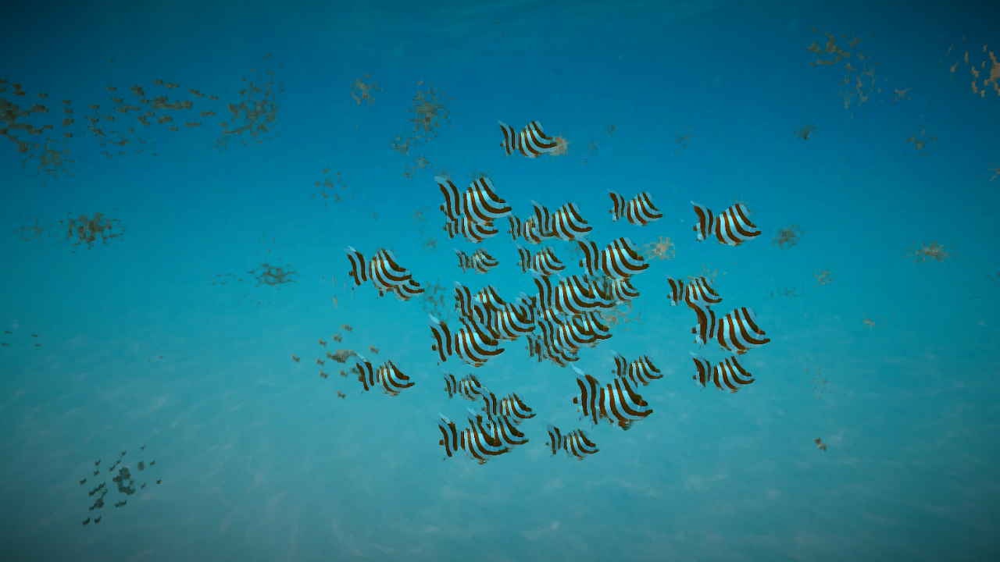

 

 

# About

This was my final project for a graphics programming course. Our goal was to create an environment with fish that were flocking and make it look like a painting via a kuwahara filter. 

In order to have the fish flock in an efficient manner, I implemented the flocking algorithm utilizing GPU dispatches through a compute shader. 

 
 

# Responsibilities

- Implemented the flocking algorithm such that it calculates boids on the GPU using compute shaders to save performance
- Increased performance to be able to calculate the position and velocity thousands of boids simultaneously while maintaining a stable 60 FPS
- Implemented instanced rendering of boids so they work with vertex shader animations created in shader graph

# Info

- Role: Compute shader flocking algorithm
- Team Size: 3
- Development Time: 3 weeks

 