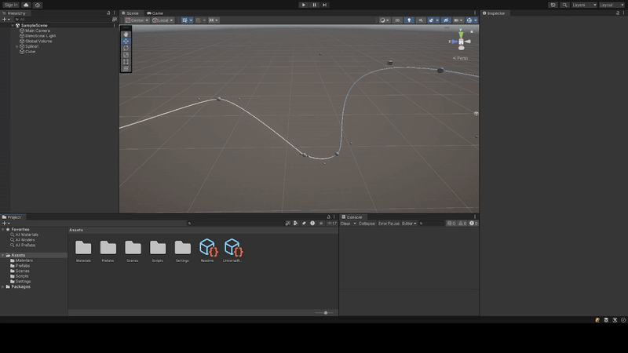
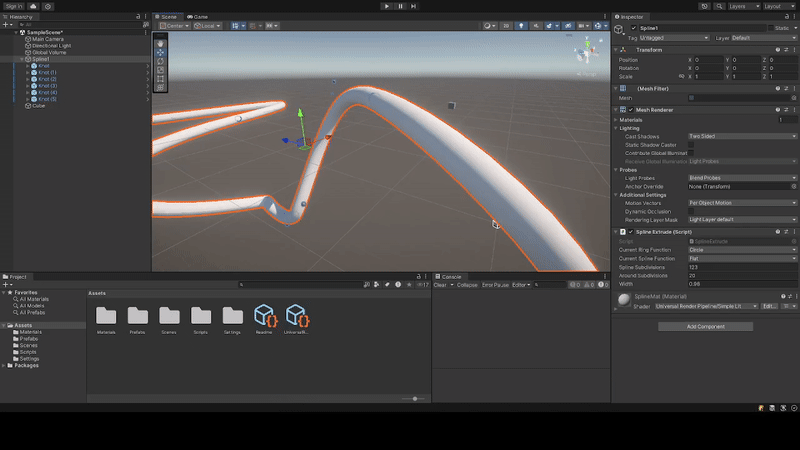

 

  <!--  -->
  
  

# About

This project was an interactive spline tool built in the Unity game engine demonstrating different mathematical curves along a spline. Then we presented at the Hudson River Undergraduate Math Conference about different applications of splines in different fields and how they worked using the Spline Tool and Desmos to aide our explanation. 

 

  

 

# Highlight

Presenting this at HRUMC with my copresenter Lizzie was very fun, and it was sick to see all the other talks about different mathematical concepts and applications. 

It was also a cool technical challenge to implement objects that can animate along the spline with constant velocity since it required generating then using look up tables to evaluate the acceleration at different points then interpolating those values where we were along the spline.  

 
 
 

# Responsibilities

## Programming Responsibilities
- Wrote algorithms to procedurally generate vertex data (Positions and UVs) and indices for a shape extruding around a curve
- Implemented different parametric functions to extrude differently along the spline and polar functions to extrude around the spline differently
- Supports dynamically regenerating meshes at runtime allowing for changes to the spline position, subdivisions, and shape around the spline
- Implemented and object the animates along the spline
    - The object can animate with uniform velocity or uniform time between each curve

## Presentation Responsibilities
- Create Bezier curve and Spline demos using Desmos and explain Bezier curves and Splines
- Help create slides in LaTex
- Explain applications of splines to game development
- Demonstrate program working
- Answer questions relevant to my part of the presentation

# Info

- Role: Sole Programmer and Co-presenter
- Team Size: 2
- Development Time: 3 weeks

